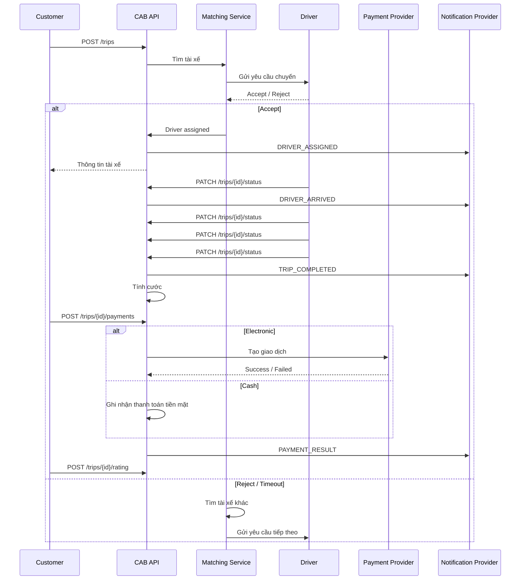

# CAB System API Document

> **API Specification dự kiến – REST API v1**
>
> Tài liệu này được xây dựng từ yêu cầu nghiệp vụ, functional requirements, use case và business rules của dự án CAB System. Các endpoint, field, status code và payload chi tiết bên dưới là **đặc tả API đề xuất** để đội Frontend/Backend/QA dùng làm cơ sở thống nhất contract; chúng không phải mô tả API của một hệ thống đang chạy thực tế.

## 1. Tổng quan

### 1.1 Title

**CAB System API v1**

### 1.2 Mục tiêu

CAB System cung cấp REST API phục vụ:

- Đăng ký, đăng nhập, đăng xuất và phân quyền.
- Quản lý khách hàng, tài xế và phương tiện.
- Tạo yêu cầu đặt xe.
- Tìm và phân công tài xế.
- Quản lý vòng đời chuyến đi.
- Theo dõi vị trí và trạng thái chuyến.
- Tính cước và thanh toán tiền mặt/thanh toán điện tử.
- Gửi thông báo.
- Xem lịch sử và đánh giá tài xế.
- Vận hành, tra cứu giao dịch và báo cáo.
- Ghi nhận audit log cho các thao tác quan trọng.

### 1.3 Base URL

```text
/api/v1
```

Ví dụ môi trường:

```text
http://localhost:8080/api/v1
https://api.example.com/api/v1
```

### 1.4 Định dạng dữ liệu

- Request/Response chính: `application/json`
- Encoding: `UTF-8`
- Authentication: Bearer Token
- Time format: ISO 8601 UTC, ví dụ `2026-09-07T10:30:00Z`

---

## 2. Authentication & Headers

### 2.1 Header chuẩn

| Header | Bắt buộc | Mô tả |
|---|---:|---|
| `Authorization` | Có* | `Bearer <access_token>` cho endpoint yêu cầu đăng nhập |
| `Content-Type` | Có | `application/json` |
| `Accept` | Khuyến nghị | `application/json` |
| `X-Request-Id` | Khuyến nghị | ID dùng để trace request |

\* Các endpoint đăng ký/đăng nhập có thể không yêu cầu `Authorization`.

### 2.2 Ví dụ

```http
Authorization: Bearer eyJhbGciOi...
Content-Type: application/json
Accept: application/json
X-Request-Id: req_01JABCXYZ
```

---

## 3. Quy ước Response

### 3.1 Response thành công

```json
{
  "success": true,
  "data": {},
  "meta": {
    "request_id": "req_01JABCXYZ"
  }
}
```

### 3.2 Response lỗi

```json
{
  "success": false,
  "error": {
    "code": "TRIP_NOT_FOUND",
    "message": "Trip does not exist.",
    "details": {}
  },
  "meta": {
    "request_id": "req_01JABCXYZ"
  }
}
```

### 3.3 HTTP Status Codes

| Code | Ý nghĩa |
|---:|---|
| `200` | Request thành công |
| `201` | Tạo resource thành công |
| `204` | Thành công, không có response body |
| `400` | Request không hợp lệ |
| `401` | Chưa xác thực / token không hợp lệ |
| `403` | Không có quyền |
| `404` | Không tìm thấy resource |
| `409` | Xung đột trạng thái hoặc resource |
| `422` | Validation thất bại |
| `429` | Quá nhiều request |
| `500` | Internal Server Error |
| `502` | Lỗi từ hệ thống tích hợp bên ngoài |
| `503` | Service tạm thời không khả dụng |

---

# 4. API Endpoints

## 4.1 Authentication

### 4.1.1 Đăng ký tài khoản

**POST** `/auth/register`

#### Headers

```http
Content-Type: application/json
```

#### Request Body

```json
{
  "role": "CUSTOMER",
  "full_name": "Nguyen Van A",
  "phone": "0901234567",
  "email": "a@example.com",
  "password": "StrongPassword123!"
}
```

| Field | Type | Required | Mô tả |
|---|---|---:|---|
| `role` | string | Có | `CUSTOMER` hoặc `DRIVER` |
| `full_name` | string | Có | Họ tên |
| `phone` | string | Có | Số điện thoại |
| `email` | string | Có | Email duy nhất |
| `password` | string | Có | Mật khẩu |

#### Response `201`

```json
{
  "success": true,
  "data": {
    "user_id": "usr_001",
    "role": "CUSTOMER",
    "full_name": "Nguyen Van A",
    "phone": "0901234567",
    "email": "a@example.com",
    "status": "ACTIVE"
  }
}
```

#### Errors

| HTTP | Error code | Mô tả |
|---:|---|---|
| 409 | `EMAIL_ALREADY_EXISTS` | Email đã tồn tại |
| 409 | `PHONE_ALREADY_EXISTS` | Số điện thoại đã tồn tại |
| 422 | `VALIDATION_ERROR` | Dữ liệu không hợp lệ |

#### Sample Call

```bash
curl -X POST "http://localhost:8080/api/v1/auth/register" \
  -H "Content-Type: application/json" \
  -d '{
    "role": "CUSTOMER",
    "full_name": "Nguyen Van A",
    "phone": "0901234567",
    "email": "a@example.com",
    "password": "StrongPassword123!"
  }'
```

---

### 4.1.2 Đăng nhập

**POST** `/auth/login`

#### Request Body

```json
{
  "login": "a@example.com",
  "password": "StrongPassword123!"
}
```

#### Response `200`

```json
{
  "success": true,
  "data": {
    "access_token": "eyJhbGciOiJIUzI1NiIs...",
    "refresh_token": "rt_abcdef123456",
    "token_type": "Bearer",
    "expires_in": 3600,
    "user": {
      "id": "usr_001",
      "role": "CUSTOMER",
      "full_name": "Nguyen Van A"
    }
  }
}
```

#### Errors

- `401 INVALID_CREDENTIALS`
- `403 ACCOUNT_INACTIVE`

---

### 4.1.3 Đăng xuất

**POST** `/auth/logout`

#### Request Body

```json
{
  "refresh_token": "rt_abcdef123456"
}
```

#### Response `204`

Không có response body.

---

### 4.1.4 Lấy thông tin người dùng hiện tại

**GET** `/auth/me`

#### Response `200`

```json
{
  "success": true,
  "data": {
    "id": "usr_001",
    "role": "CUSTOMER",
    "full_name": "Nguyen Van A",
    "phone": "0901234567",
    "email": "a@example.com",
    "status": "ACTIVE"
  }
}
```

---

## 4.2 Customers

### 4.2.1 Lấy hồ sơ khách hàng

**GET** `/customers/me`

#### Response `200`

```json
{
  "success": true,
  "data": {
    "id": "cus_001",
    "user_id": "usr_001",
    "full_name": "Nguyen Van A",
    "phone": "0901234567",
    "email": "a@example.com",
    "created_at": "2026-09-07T10:00:00Z"
  }
}
```

### 4.2.2 Cập nhật hồ sơ khách hàng

**PUT** `/customers/me`

#### Request Body

```json
{
  "full_name": "Nguyen Van B",
  "email": "b@example.com"
}
```

#### Response `200`

Trả về customer profile đã cập nhật.

---

## 4.3 Drivers

### 4.3.1 Lấy hồ sơ tài xế

**GET** `/drivers/me`

#### Response `200`

```json
{
  "success": true,
  "data": {
    "id": "drv_001",
    "full_name": "Tran Van D",
    "phone": "0912345678",
    "rating": 4.8,
    "status": "AVAILABLE"
  }
}
```

### 4.3.2 Cập nhật hồ sơ tài xế

**PUT** `/drivers/me`

#### Request Body

```json
{
  "full_name": "Tran Van D",
  "phone": "0912345678"
}
```

### 4.3.3 Cập nhật trạng thái hoạt động

**PATCH** `/drivers/me/status`

#### Request Body

```json
{
  "status": "AVAILABLE"
}
```

Enum:

```text
AVAILABLE
UNAVAILABLE
BUSY
```

#### Business Rule

Chỉ tài xế ở trạng thái phù hợp và không có chuyến đang thực hiện mới được lựa chọn cho chuyến mới.

### 4.3.4 Cập nhật vị trí tài xế

**POST** `/drivers/me/location`

#### Request Body

```json
{
  "latitude": 10.776889,
  "longitude": 106.700806,
  "recorded_at": "2026-09-07T10:30:00Z"
}
```

#### Response `200`

```json
{
  "success": true,
  "data": {
    "driver_id": "drv_001",
    "latitude": 10.776889,
    "longitude": 106.700806,
    "recorded_at": "2026-09-07T10:30:00Z"
  }
}
```

---

## 4.4 Vehicles

### 4.4.1 Tạo/cập nhật phương tiện

**PUT** `/drivers/me/vehicle`

#### Request Body

```json
{
  "vehicle_type": "CAR",
  "brand": "Toyota",
  "model": "Vios",
  "plate_number": "51A-123.45",
  "color": "White"
}
```

### 4.4.2 Lấy thông tin phương tiện

**GET** `/drivers/me/vehicle`

#### Response `200`

```json
{
  "success": true,
  "data": {
    "id": "veh_001",
    "vehicle_type": "CAR",
    "brand": "Toyota",
    "model": "Vios",
    "plate_number": "51A-123.45",
    "color": "White"
  }
}
```

---

# 5. Trip / Ride API

## 5.1 Tạo yêu cầu đặt chuyến

**POST** `/trips`

#### Request Body

```json
{
  "pickup": {
    "latitude": 10.776889,
    "longitude": 106.700806,
    "address": "Chợ Bến Thành, Quận 1, TP.HCM"
  },
  "destination": {
    "latitude": 10.823099,
    "longitude": 106.629664,
    "address": "Sân bay Tân Sơn Nhất, TP.HCM"
  },
  "vehicle_type": "CAR"
}
```

| Field | Type | Required | Mô tả |
|---|---|---:|---|
| `pickup.latitude` | number | Có | Vĩ độ điểm đón |
| `pickup.longitude` | number | Có | Kinh độ điểm đón |
| `pickup.address` | string | Có | Địa chỉ hiển thị |
| `destination.latitude` | number | Có | Vĩ độ điểm đến |
| `destination.longitude` | number | Có | Kinh độ điểm đến |
| `destination.address` | string | Có | Địa chỉ hiển thị |
| `vehicle_type` | string | Có | Loại xe |

#### Response `201`

```json
{
  "success": true,
  "data": {
    "trip_id": "trip_001",
    "customer_id": "cus_001",
    "status": "SEARCHING_DRIVER",
    "pickup": {
      "latitude": 10.776889,
      "longitude": 106.700806,
      "address": "Chợ Bến Thành, Quận 1, TP.HCM"
    },
    "destination": {
      "latitude": 10.823099,
      "longitude": 106.629664,
      "address": "Sân bay Tân Sơn Nhất, TP.HCM"
    },
    "vehicle_type": "CAR",
    "created_at": "2026-09-07T10:30:00Z"
  }
}
```

#### Errors

- `422 INVALID_PICKUP`
- `422 INVALID_DESTINATION`
- `422 INVALID_VEHICLE_TYPE`
- `409 ACTIVE_TRIP_EXISTS`

---

## 5.2 Lấy chi tiết chuyến

**GET** `/trips/{trip_id}`

### Path Parameter

| Name | Type | Required | Mô tả |
|---|---|---:|---|
| `trip_id` | string | Có | ID chuyến |

#### Response `200`

```json
{
  "success": true,
  "data": {
    "trip_id": "trip_001",
    "status": "DRIVER_ASSIGNED",
    "customer": {
      "id": "cus_001",
      "name": "Nguyen Van A"
    },
    "driver": {
      "id": "drv_001",
      "name": "Tran Van D",
      "rating": 4.8,
      "phone": "0912345678"
    },
    "vehicle": {
      "plate_number": "51A-123.45",
      "vehicle_type": "CAR"
    },
    "pickup": {},
    "destination": {},
    "fare": null
  }
}
```

---

## 5.3 Theo dõi chuyến

**GET** `/trips/{trip_id}/tracking`

#### Response `200`

```json
{
  "success": true,
  "data": {
    "trip_id": "trip_001",
    "status": "IN_PROGRESS",
    "driver_location": {
      "latitude": 10.780100,
      "longitude": 106.695200,
      "recorded_at": "2026-09-07T10:45:00Z"
    },
    "estimated_arrival_minutes": 7
  }
}
```

---

## 5.4 Tài xế cập nhật trạng thái chuyến

**PATCH** `/trips/{trip_id}/status`

#### Request Body

```json
{
  "status": "DRIVER_ARRIVED"
}
```

Các trạng thái chính:

```text
SEARCHING_DRIVER
DRIVER_ASSIGNED
DRIVER_EN_ROUTE
DRIVER_ARRIVED
PASSENGER_PICKED_UP
IN_PROGRESS
COMPLETED
CANCELLED
```

#### Response `200`

```json
{
  "success": true,
  "data": {
    "trip_id": "trip_001",
    "status": "DRIVER_ARRIVED",
    "updated_at": "2026-09-07T10:50:00Z"
  }
}
```

#### Errors

- `403 NOT_ASSIGNED_DRIVER`
- `409 INVALID_STATUS_TRANSITION`
- `404 TRIP_NOT_FOUND`

---

## 5.5 Hủy chuyến

**POST** `/trips/{trip_id}/cancel`

#### Request Body

```json
{
  "reason": "CUSTOMER_CHANGED_MIND"
}
```

#### Response `200`

```json
{
  "success": true,
  "data": {
    "trip_id": "trip_001",
    "status": "CANCELLED",
    "cancelled_by": "CUSTOMER",
    "cancel_reason": "CUSTOMER_CHANGED_MIND",
    "cancelled_at": "2026-09-07T10:55:00Z"
  }
}
```

#### Errors

- `409 TRIP_NOT_CANCELLABLE`
- `409 TRIP_ALREADY_COMPLETED`

---

# 6. Driver Matching

## 6.1 Tìm tài xế phù hợp

**POST** `/trips/{trip_id}/matching/search`

Endpoint nội bộ hoặc dành cho service/operator; frontend customer không nhất thiết gọi trực tiếp.

#### Response `200`

```json
{
  "success": true,
  "data": {
    "trip_id": "trip_001",
    "candidates": [
      {
        "driver_id": "drv_001",
        "distance_km": 1.2,
        "rating": 4.8,
        "vehicle_type": "CAR",
        "status": "AVAILABLE"
      },
      {
        "driver_id": "drv_002",
        "distance_km": 1.7,
        "rating": 4.7,
        "vehicle_type": "CAR",
        "status": "AVAILABLE"
      }
    ]
  }
}
```

### Business Rules

- Chỉ tìm tài xế đang sẵn sàng.
- Tài xế phải phù hợp với loại xe/dịch vụ.
- Ưu tiên tài xế gần điểm đón.
- Có thể dùng thêm tiêu chí vận hành như rating.
- Một tài xế không được đồng thời nhận hai chuyến.

---

## 6.2 Gửi yêu cầu cho tài xế

**POST** `/trips/{trip_id}/matching/dispatch`

#### Request Body

```json
{
  "driver_id": "drv_001"
}
```

#### Response `202`

```json
{
  "success": true,
  "data": {
    "trip_id": "trip_001",
    "driver_id": "drv_001",
    "dispatch_status": "PENDING_RESPONSE",
    "expires_at": "2026-09-07T10:56:00Z"
  }
}
```

---

## 6.3 Tài xế chấp nhận chuyến

**POST** `/trips/{trip_id}/accept`

#### Response `200`

```json
{
  "success": true,
  "data": {
    "trip_id": "trip_001",
    "driver_id": "drv_001",
    "status": "DRIVER_ASSIGNED"
  }
}
```

#### Errors

- `409 TRIP_ALREADY_ASSIGNED`
- `409 TRIP_ALREADY_CANCELLED`
- `409 DRIVER_NOT_AVAILABLE`

---

## 6.4 Tài xế từ chối chuyến

**POST** `/trips/{trip_id}/reject`

#### Request Body

```json
{
  "reason": "TOO_FAR"
}
```

#### Response `200`

```json
{
  "success": true,
  "data": {
    "trip_id": "trip_001",
    "driver_id": "drv_001",
    "status": "DRIVER_REJECTED"
  }
}
```

Hệ thống tiếp tục tìm tài xế khác theo chính sách matching.

---

# 7. Fare & Payment API

## 7.1 Tính cước

**POST** `/trips/{trip_id}/fare/estimate`

#### Request Body

```json
{
  "vehicle_type": "CAR"
}
```

#### Response `200`

```json
{
  "success": true,
  "data": {
    "trip_id": "trip_001",
    "currency": "VND",
    "base_fare": 10000,
    "distance_fare": 85000,
    "total_amount": 95000
  }
}
```

> Công thức cước thực tế cần được cấu hình theo bảng giá doanh nghiệp. Tài liệu nghiệp vụ hiện chỉ xác định số tiền dựa trên loại dịch vụ và thông tin chuyến đi.

---

## 7.2 Lấy cước cuối chuyến

**GET** `/trips/{trip_id}/fare`

#### Response `200`

```json
{
  "success": true,
  "data": {
    "trip_id": "trip_001",
    "currency": "VND",
    "amount": 95000,
    "status": "FINAL"
  }
}
```

---

## 7.3 Thanh toán

**POST** `/trips/{trip_id}/payments`

#### Request Body

```json
{
  "method": "CASH"
}
```

Hoặc:

```json
{
  "method": "ELECTRONIC",
  "provider": "EXAMPLE_PAYMENT_PROVIDER"
}
```

Enum:

```text
CASH
ELECTRONIC
```

#### Response `201`

```json
{
  "success": true,
  "data": {
    "payment_id": "pay_001",
    "trip_id": "trip_001",
    "method": "ELECTRONIC",
    "status": "PENDING",
    "amount": 95000,
    "currency": "VND"
  }
}
```

### Bảo mật

CAB System **không lưu trực tiếp thông tin nhạy cảm của thẻ/tài khoản thanh toán**. Thanh toán điện tử được xử lý thông qua Payment Provider.

---

## 7.4 Callback kết quả thanh toán

**POST** `/payments/callback`

Endpoint này dành cho Payment Provider gọi vào hệ thống.

#### Request Body

```json
{
  "transaction_id": "txn_001",
  "payment_id": "pay_001",
  "status": "SUCCESS",
  "amount": 95000,
  "currency": "VND",
  "provider_reference": "provider_ref_001"
}
```

#### Response `200`

```json
{
  "success": true,
  "data": {
    "payment_id": "pay_001",
    "status": "SUCCESS"
  }
}
```

#### Errors

- `400 INVALID_CALLBACK`
- `409 PAYMENT_ALREADY_FINALIZED`

---

## 7.5 Retry thanh toán

**POST** `/trips/{trip_id}/payments/{payment_id}/retry`

#### Response `202`

```json
{
  "success": true,
  "data": {
    "payment_id": "pay_001",
    "status": "PENDING"
  }
}
```

---

## 7.6 Tra cứu giao dịch

**GET** `/payments/{payment_id}`

#### Response `200`

```json
{
  "success": true,
  "data": {
    "payment_id": "pay_001",
    "trip_id": "trip_001",
    "amount": 95000,
    "currency": "VND",
    "method": "ELECTRONIC",
    "status": "SUCCESS",
    "provider_reference": "provider_ref_001",
    "created_at": "2026-09-07T11:00:00Z"
  }
}
```

---

# 8. Notification API

## 8.1 Gửi thông báo

**POST** `/notifications`

Endpoint nội bộ.

#### Request Body

```json
{
  "recipient_id": "cus_001",
  "channel": "PUSH",
  "type": "DRIVER_ASSIGNED",
  "data": {
    "trip_id": "trip_001"
  }
}
```

Enum channel:

```text
PUSH
SMS
EMAIL
```

Enum type:

```text
TRIP_CREATED
DRIVER_ASSIGNED
DRIVER_ARRIVED
TRIP_COMPLETED
PAYMENT_RESULT
NEW_TRIP
```

### Business Rule

Thông báo được trigger bởi các sự kiện quan trọng của chuyến đi và thanh toán.

---

## 8.2 Lịch sử thông báo

**GET** `/notifications`

### Query Parameters

| Parameter | Type | Required | Mô tả |
|---|---|---:|---|
| `page` | integer | Không | Trang |
| `page_size` | integer | Không | Số record/trang |
| `unread` | boolean | Không | Lọc thông báo chưa đọc |

Ví dụ:

```text
GET /api/v1/notifications?page=1&page_size=20&unread=true
```

---

# 9. Rating API

## 9.1 Đánh giá tài xế

**POST** `/trips/{trip_id}/rating`

#### Request Body

```json
{
  "rating": 5,
  "comment": "Tài xế thân thiện và đúng giờ."
}
```

| Field | Type | Required | Mô tả |
|---|---|---:|---|
| `rating` | integer | Có | 1–5 |
| `comment` | string | Không | Nhận xét |

#### Response `201`

```json
{
  "success": true,
  "data": {
    "rating_id": "rating_001",
    "trip_id": "trip_001",
    "driver_id": "drv_001",
    "rating": 5,
    "comment": "Tài xế thân thiện và đúng giờ."
  }
}
```

#### Errors

- `409 RATING_ALREADY_EXISTS`
- `409 TRIP_NOT_COMPLETED`
- `403 NOT_TRIP_CUSTOMER`

---

# 10. Trip History API

## 10.1 Danh sách lịch sử chuyến

**GET** `/trips`

### Query Parameters

| Parameter | Type | Required | Mô tả |
|---|---|---:|---|
| `status` | string | Không | Lọc theo trạng thái |
| `from` | datetime | Không | Từ thời điểm |
| `to` | datetime | Không | Đến thời điểm |
| `page` | integer | Không | Trang |
| `page_size` | integer | Không | Số record/trang |
| `sort` | string | Không | Ví dụ `created_at:desc` |

Ví dụ:

```text
GET /api/v1/trips?status=COMPLETED&page=1&page_size=20&sort=created_at:desc
```

#### Response `200`

```json
{
  "success": true,
  "data": [
    {
      "trip_id": "trip_001",
      "status": "COMPLETED",
      "pickup_address": "Chợ Bến Thành",
      "destination_address": "Sân bay Tân Sơn Nhất",
      "amount": 95000,
      "completed_at": "2026-09-07T11:00:00Z"
    }
  ],
  "meta": {
    "page": 1,
    "page_size": 20,
    "total": 1
  }
}
```

---

# 11. Operator API

> Các endpoint trong phần này yêu cầu role `OPERATOR` hoặc quyền tương ứng.

## 11.1 Danh sách khách hàng

**GET** `/admin/customers`

### Query Parameters

```text
page
page_size
search
status
```

## 11.2 Chi tiết khách hàng

**GET** `/admin/customers/{customer_id}`

## 11.3 Danh sách tài xế

**GET** `/admin/drivers`

### Query Parameters

```text
page
page_size
search
status
vehicle_type
```

## 11.4 Chi tiết tài xế

**GET** `/admin/drivers/{driver_id}`

## 11.5 Quản lý phương tiện

**GET** `/admin/vehicles`

### Query Parameters

```text
page
page_size
vehicle_type
status
```

## 11.6 Theo dõi chuyến đang diễn ra

**GET** `/admin/trips/active`

#### Response `200`

```json
{
  "success": true,
  "data": [
    {
      "trip_id": "trip_001",
      "status": "IN_PROGRESS",
      "customer_id": "cus_001",
      "driver_id": "drv_001",
      "driver_location": {
        "latitude": 10.7801,
        "longitude": 106.6952
      }
    }
  ]
}
```

## 11.7 Xử lý chuyến lỗi

**POST** `/admin/trips/{trip_id}/resolve`

#### Request Body

```json
{
  "action": "REASSIGN_DRIVER",
  "note": "Tài xế mất kết nối."
}
```

Các action có thể triển khai:

```text
REASSIGN_DRIVER
CANCEL_TRIP
MARK_PAYMENT_REVIEW
```

## 11.8 Tra cứu giao dịch

**GET** `/admin/payments`

### Query Parameters

```text
trip_id
payment_id
status
from
to
page
page_size
```

---

# 12. Administrator API

> Yêu cầu role `ADMINISTRATOR`.

## 12.1 Danh sách tài khoản

**GET** `/admin/users`

## 12.2 Cập nhật trạng thái tài khoản

**PATCH** `/admin/users/{user_id}/status`

#### Request Body

```json
{
  "status": "ACTIVE"
}
```

## 12.3 Phân quyền

**PUT** `/admin/users/{user_id}/roles`

#### Request Body

```json
{
  "roles": [
    "OPERATOR"
  ]
}
```

## 12.4 Xem audit log

**GET** `/admin/audit-logs`

### Query Parameters

| Parameter | Mô tả |
|---|---|
| `actor_id` | Người thực hiện |
| `action` | Loại thao tác |
| `from` | Thời gian bắt đầu |
| `to` | Thời gian kết thúc |
| `page` | Trang |
| `page_size` | Kích thước trang |

#### Response `200`

```json
{
  "success": true,
  "data": [
    {
      "id": "log_001",
      "actor_id": "usr_admin_001",
      "action": "UPDATE_USER_ROLE",
      "resource_type": "USER",
      "resource_id": "usr_001",
      "created_at": "2026-09-07T11:15:00Z"
    }
  ]
}
```

---

# 13. Reporting API

## 13.1 Báo cáo số lượng chuyến

**GET** `/reports/trips`

### Query Parameters

```text
from
to
group_by=day|week|month
```

#### Response `200`

```json
{
  "success": true,
  "data": {
    "total_trips": 1250,
    "completed_trips": 1100,
    "cancelled_trips": 100,
    "failed_trips": 50
  }
}
```

## 13.2 Báo cáo doanh thu

**GET** `/reports/revenue`

#### Response `200`

```json
{
  "success": true,
  "data": {
    "currency": "VND",
    "gross_revenue": 125000000,
    "cash_revenue": 50000000,
    "electronic_revenue": 75000000
  }
}
```

## 13.3 Tỷ lệ hoàn thành

**GET** `/reports/completion-rate`

#### Response `200`

```json
{
  "success": true,
  "data": {
    "completion_rate": 88.0
  }
}
```

## 13.4 Tỷ lệ hủy

**GET** `/reports/cancellation-rate`

#### Response `200`

```json
{
  "success": true,
  "data": {
    "cancellation_rate": 8.0
  }
}
```

## 13.5 Hiệu quả tài xế

**GET** `/reports/driver-performance`

### Query Parameters

```text
from
to
driver_id
page
page_size
```

---

# 14. Data Models

## 14.1 User

```json
{
  "id": "usr_001",
  "role": "CUSTOMER",
  "full_name": "Nguyen Van A",
  "phone": "0901234567",
  "email": "a@example.com",
  "status": "ACTIVE",
  "created_at": "2026-09-07T10:00:00Z"
}
```

## 14.2 Trip

```json
{
  "trip_id": "trip_001",
  "customer_id": "cus_001",
  "driver_id": "drv_001",
  "vehicle_id": "veh_001",
  "pickup": {},
  "destination": {},
  "vehicle_type": "CAR",
  "status": "IN_PROGRESS",
  "fare_amount": 95000,
  "created_at": "2026-09-07T10:30:00Z",
  "completed_at": null
}
```

## 14.3 Payment

```json
{
  "payment_id": "pay_001",
  "trip_id": "trip_001",
  "method": "ELECTRONIC",
  "amount": 95000,
  "currency": "VND",
  "status": "SUCCESS",
  "provider_reference": "provider_ref_001",
  "created_at": "2026-09-07T11:00:00Z"
}
```

## 14.4 Rating

```json
{
  "rating_id": "rating_001",
  "trip_id": "trip_001",
  "customer_id": "cus_001",
  "driver_id": "drv_001",
  "rating": 5,
  "comment": "Rất tốt."
}
```

---

# 15. Error Codes

| Error Code | HTTP | Mô tả |
|---|---:|---|
| `VALIDATION_ERROR` | 422 | Dữ liệu request không hợp lệ |
| `INVALID_CREDENTIALS` | 401 | Sai tài khoản hoặc mật khẩu |
| `ACCOUNT_INACTIVE` | 403 | Tài khoản không hoạt động |
| `EMAIL_ALREADY_EXISTS` | 409 | Email đã tồn tại |
| `PHONE_ALREADY_EXISTS` | 409 | Số điện thoại đã tồn tại |
| `TRIP_NOT_FOUND` | 404 | Không tìm thấy chuyến |
| `ACTIVE_TRIP_EXISTS` | 409 | Khách hàng đã có chuyến đang hoạt động |
| `TRIP_NOT_CANCELLABLE` | 409 | Chuyến hiện tại không được phép hủy |
| `INVALID_STATUS_TRANSITION` | 409 | Chuyển trạng thái không hợp lệ |
| `NOT_ASSIGNED_DRIVER` | 403 | Tài xế không phải tài xế được phân công |
| `DRIVER_NOT_AVAILABLE` | 409 | Tài xế không ở trạng thái nhận chuyến |
| `NO_DRIVER_AVAILABLE` | 404 | Không tìm được tài xế phù hợp |
| `PAYMENT_FAILED` | 502 | Payment Provider trả về thất bại |
| `PAYMENT_ALREADY_FINALIZED` | 409 | Giao dịch đã ở trạng thái cuối |
| `RATING_ALREADY_EXISTS` | 409 | Chuyến đã được đánh giá |
| `TRIP_NOT_COMPLETED` | 409 | Chưa đủ điều kiện đánh giá |
| `FORBIDDEN` | 403 | Không đủ quyền |
| `RESOURCE_NOT_FOUND` | 404 | Không tìm thấy resource |
| `INTERNAL_ERROR` | 500 | Lỗi hệ thống |

### Sample Error

```json
{
  "success": false,
  "error": {
    "code": "NO_DRIVER_AVAILABLE",
    "message": "Không tìm được tài xế phù hợp.",
    "details": {
      "trip_id": "trip_001"
    }
  },
  "meta": {
    "request_id": "req_01JABCXYZ"
  }
}
```

---

# 16. API Flow – Đặt xe đến hoàn thành



---

# 17. Mapping Functional Requirements → API

| FR | Requirement | API chính |
|---|---|---|
| FR-01 | Đăng ký tài khoản | `POST /auth/register` |
| FR-02 | Đăng nhập | `POST /auth/login` |
| FR-03 | Đăng xuất | `POST /auth/logout` |
| FR-04 | Cập nhật thông tin | `PUT /customers/me`, `PUT /drivers/me` |
| FR-05 | Phân quyền | `PUT /admin/users/{id}/roles` |
| FR-06 | Hồ sơ tài xế | `GET/PUT /drivers/me` |
| FR-07 | Phương tiện | `GET/PUT /drivers/me/vehicle` |
| FR-08 | Trạng thái hoạt động | `PATCH /drivers/me/status` |
| FR-09 | Cập nhật vị trí | `POST /drivers/me/location` |
| FR-10 | Điểm đón | `POST /trips` |
| FR-11 | Điểm đến | `POST /trips` |
| FR-12 | Loại xe | `POST /trips` |
| FR-13 | Tạo yêu cầu đặt xe | `POST /trips` |
| FR-14 | Theo dõi yêu cầu | `GET /trips/{trip_id}` |
| FR-15 | Tìm tài xế | `POST /trips/{id}/matching/search` |
| FR-16 | Ưu tiên tài xế | Matching Service |
| FR-17 | Gửi yêu cầu chuyến | `POST /trips/{id}/matching/dispatch` |
| FR-18 | Chấp nhận chuyến | `POST /trips/{id}/accept` |
| FR-19 | Từ chối chuyến | `POST /trips/{id}/reject` |
| FR-20 | Tìm tài xế thay thế | Matching Service |
| FR-21 | Không tìm được tài xế | `NO_DRIVER_AVAILABLE` |
| FR-22 | Xác nhận chuyến | `POST /trips/{id}/accept` |
| FR-23–27 | Cập nhật trạng thái | `PATCH /trips/{id}/status` |
| FR-28 | Theo dõi chuyến | `GET /trips/{id}/tracking` |
| FR-29 | Tính cước | `POST/GET /trips/{id}/fare*` |
| FR-30 | Tiền mặt | `POST /trips/{id}/payments` |
| FR-31 | Thanh toán điện tử | `POST /trips/{id}/payments` |
| FR-32 | Thanh toán thất bại | Retry Payment |
| FR-33–39 | Thông báo | `/notifications` |
| FR-40–41 | Lịch sử/chủng chi tiết | `GET /trips`, `GET /trips/{id}` |
| FR-42 | Đánh giá | `POST /trips/{id}/rating` |
| FR-43–48 | Quản trị vận hành | `/admin/*` |
| FR-49 | Phân quyền | `/admin/users/{id}/roles` |
| FR-50–54 | Báo cáo | `/reports/*` |
| FR-55–57 | Auth, access control, audit | `/auth/*`, middleware, `/admin/audit-logs` |

---

# 18. Open Business Rules cần chốt trước khi implement

Đặc tả API hiện tại có một số giá trị cần Business Analyst/Management chốt:

1. **Công thức tính cước chính thức**: giá mở cửa, giá/km, giá theo thời gian, phụ phí.
2. **Timeout tài xế**: bao nhiêu giây/phút trước khi xem là không phản hồi.
3. **Thuật toán matching**: chỉ khoảng cách hay kết hợp rating, số chuyến, khu vực, mức độ bận.
4. **Chính sách hủy chuyến**: trạng thái nào được hủy, có phí hủy hay không.
5. **Retry payment**: tối đa bao nhiêu lần và sau bao lâu.
6. **Danh sách loại xe**: `CAR`, `BIKE`, `SUV`... cần chốt enum thực tế.
7. **Quy tắc tiền mặt**: thời điểm xác nhận đã thu tiền.
8. **Xử lý offline/mất kết nối**: cơ chế retry, idempotency và đồng bộ trạng thái.
9. **GPS update frequency**: ví dụ mỗi 2–5 giây hoặc theo điều kiện mạng.
10. **Phân quyền chi tiết** của Operator/Admin.
11. **Retention của audit log** và dữ liệu vị trí.
12. **Webhook security** cho Payment Provider/Notification Provider.

---

# 19. Idempotency & Security Recommendations

### 19.1 Idempotency

Các API có khả năng tạo giao dịch nên hỗ trợ:

```http
Idempotency-Key: 01JABCXYZ123
```

Đặc biệt:

- `POST /trips`
- `POST /trips/{id}/payments`
- `POST /trips/{id}/rating`
- Payment callback

### 19.2 Authorization

Role mẫu:

```text
CUSTOMER
DRIVER
OPERATOR
ADMINISTRATOR
```

API phải kiểm tra quyền trước các thao tác quản trị hoặc dữ liệu nhạy cảm.

### 19.3 Audit

Ghi audit cho các thao tác như:

- Đổi quyền tài khoản.
- Khóa/mở tài khoản.
- Xử lý chuyến lỗi.
- Thay đổi trạng thái giao dịch.
- Can thiệp thủ công vào chuyến.
- Các thao tác quản trị nhạy cảm.

### 19.4 Payment Data

Không lưu trực tiếp dữ liệu thẻ/tài khoản nhạy cảm trong CAB System. Chỉ lưu reference/token và metadata cần thiết do Payment Provider trả về.

---

# 20. OpenAPI / Swagger

Tài liệu này có thể được chuyển tiếp thành OpenAPI 3.x để import vào:

- Swagger Editor
- Swagger UI
- Postman
- Redoc

Khuyến nghị duy trì một file `openapi.yaml` làm contract machine-readable song song với file tài liệu Markdown này.

---

## 21. Quick Endpoint Index

| Method | Endpoint | Mô tả |
|---|---|---|
| POST | `/auth/register` | Đăng ký |
| POST | `/auth/login` | Đăng nhập |
| POST | `/auth/logout` | Đăng xuất |
| GET | `/auth/me` | Current user |
| GET/PUT | `/customers/me` | Customer profile |
| GET/PUT | `/drivers/me` | Driver profile |
| PATCH | `/drivers/me/status` | Driver status |
| POST | `/drivers/me/location` | GPS location |
| GET/PUT | `/drivers/me/vehicle` | Vehicle |
| POST | `/trips` | Tạo chuyến |
| GET | `/trips/{trip_id}` | Chi tiết chuyến |
| GET | `/trips/{trip_id}/tracking` | Theo dõi |
| PATCH | `/trips/{trip_id}/status` | Cập nhật trạng thái |
| POST | `/trips/{trip_id}/cancel` | Hủy chuyến |
| POST | `/trips/{trip_id}/matching/search` | Tìm tài xế |
| POST | `/trips/{trip_id}/matching/dispatch` | Dispatch tài xế |
| POST | `/trips/{trip_id}/accept` | Nhận chuyến |
| POST | `/trips/{trip_id}/reject` | Từ chối |
| POST | `/trips/{trip_id}/fare/estimate` | Ước tính cước |
| GET | `/trips/{trip_id}/fare` | Cước cuối |
| POST | `/trips/{trip_id}/payments` | Thanh toán |
| POST | `/payments/callback` | Payment callback |
| POST | `/trips/{trip_id}/payments/{payment_id}/retry` | Retry payment |
| GET | `/payments/{payment_id}` | Chi tiết payment |
| POST | `/notifications` | Gửi notification |
| GET | `/notifications` | Lịch sử notification |
| POST | `/trips/{trip_id}/rating` | Đánh giá |
| GET | `/trips` | Lịch sử chuyến |
| GET | `/admin/customers` | Quản lý customer |
| GET | `/admin/drivers` | Quản lý driver |
| GET | `/admin/vehicles` | Quản lý vehicle |
| GET | `/admin/trips/active` | Theo dõi chuyến |
| POST | `/admin/trips/{trip_id}/resolve` | Xử lý chuyến lỗi |
| GET | `/admin/payments` | Tra cứu giao dịch |
| GET | `/admin/users` | Quản lý tài khoản |
| PATCH | `/admin/users/{user_id}/status` | Khóa/mở tài khoản |
| PUT | `/admin/users/{user_id}/roles` | Phân quyền |
| GET | `/admin/audit-logs` | Audit log |
| GET | `/reports/trips` | Báo cáo chuyến |
| GET | `/reports/revenue` | Báo cáo doanh thu |
| GET | `/reports/completion-rate` | Tỷ lệ hoàn thành |
| GET | `/reports/cancellation-rate` | Tỷ lệ hủy |
| GET | `/reports/driver-performance` | Hiệu quả tài xế |

---

## 22. Versioning

API hiện tại:

```text
/v1
```

Khi có breaking changes nên tạo version mới:

```text
/api/v2
```

Các thay đổi không breaking nên ưu tiên backward compatible để tránh làm gián đoạn client hiện tại.
