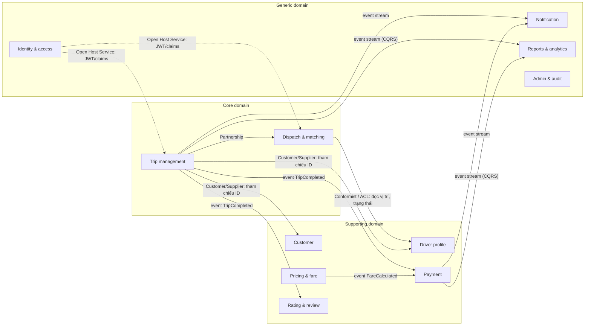
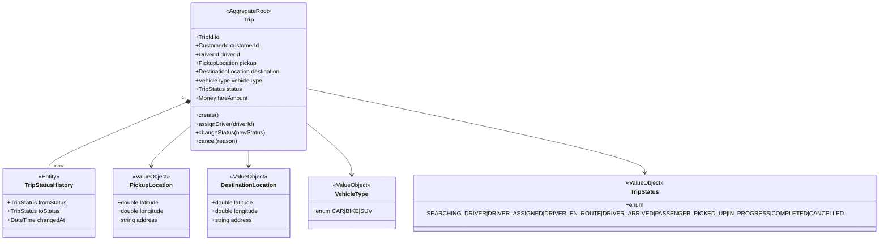
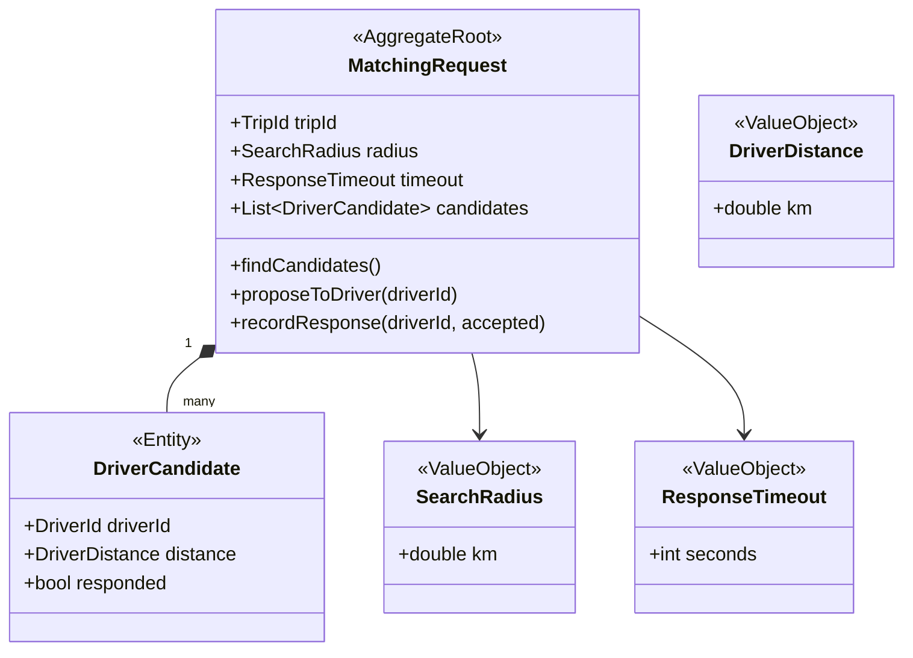

# Thiết kế Domain-Driven Design — CAB System

> Tài liệu này phân rã kiến trúc miền (domain) cho CAB System dựa trên Business Requirements Document (README.md): 12 phạm vi nghiệp vụ, 57 Functional Requirements (FR), 28 Business Rules (BR), 10 Use Case.

## Mục lục

1. [Phân loại Subdomain](#1-phân-loại-subdomain)
2. [Bounded Context](#2-bounded-context--trách-nhiệm)
3. [Context Map](#3-context-map)
4. [Tactical Design — Core Domain](#4-tactical-design--core-domain)
5. [Tactical Design — Supporting & Generic](#5-tactical-design--supporting--generic-domain)
6. [Luồng sự kiện xuyên Context](#6-luồng-sự-kiện-xuyên-context)
7. [Ubiquitous Language](#7-ubiquitous-language)
8. [Nguyên tắc thiết kế đã áp dụng](#8-nguyên-tắc-thiết-kế-đã-áp-dụng)

---

## 1. Phân loại Subdomain

| Subdomain | Loại | Lý do |
|---|---|---|
| **Trip Management** (đặt chuyến, vòng đời chuyến) | **Core** | Là lý do khách hàng dùng app — quản lý toàn bộ trạng thái chuyến từ tạo đến hoàn thành/huỷ |
| **Dispatch & Matching** (tìm & phân công tài xế) | **Core** | Thuật toán khớp tài xế–khách hàng là lợi thế cạnh tranh cốt lõi của nền tảng gọi xe, tách riêng khỏi Trip vì độ phức tạp logic (BR-02 → BR-09) |
| Customer | Supporting | Cần thiết nhưng không phải điểm khác biệt (CRUD hồ sơ khá chuẩn) |
| Driver Profile | Supporting | Tương tự Customer, thêm quản lý phương tiện/vị trí |
| Pricing & Fare | Supporting | Công thức tính giá đặc thù nghiệp vụ nhưng không phải lõi cạnh tranh |
| Payment | Supporting | Xử lý tiền quan trọng nhưng logic chủ yếu là tích hợp bên thứ 3 |
| Rating & Review | Supporting | Tăng chất lượng dịch vụ, không phải chức năng lõi |
| Identity & Access | Generic | Auth/JWT là bài toán đã có giải pháp chuẩn, không cần khác biệt hoá |
| Notification | Generic | Gửi thông báo là hạ tầng dùng chung |
| Reporting & Analytics | Generic | Đọc dữ liệu tổng hợp (CQRS read-model), không chứa business rule riêng |
| Admin & Audit | Generic | Quản trị & log — hỗ trợ vận hành, không tạo giá trị trực tiếp cho khách hàng |

---

## 2. Bounded Context & trách nhiệm

| # | Bounded Context | Trách nhiệm chính | Nguồn FR/BR |
|---|---|---|---|
| 1 | **Identity & Access** | Đăng ký, đăng nhập, đăng xuất, quản lý token, role | FR-01→04, BR-01 |
| 2 | **Customer** | Hồ sơ khách hàng | FR-05 |
| 3 | **Driver** | Hồ sơ tài xế, phương tiện, trạng thái hoạt động, vị trí | FR-06→09, BR-26 |
| 4 | **Trip Management** (Core) | Tạo chuyến, vòng đời trạng thái, huỷ chuyến, lịch sử | FR-10→14, 23→28, 40→41, BR-10→12 |
| 5 | **Dispatch & Matching** (Core) | Tìm tài xế phù hợp, phân công, accept/reject | FR-15→22, BR-02→09 |
| 6 | **Pricing & Fare** | Tính cước, ước tính giá | FR-29, BR-13 |
| 7 | **Payment** | Thanh toán, callback, retry | FR-30→33, BR-14→17 |
| 8 | **Rating & Review** | Đánh giá tài xế sau chuyến | FR-42, BR-18,19 |
| 9 | **Notification** | Gửi thông báo cho Customer/Driver | FR-43,44 |
| 10 | **Reporting & Analytics** | Báo cáo doanh thu, hiệu suất | FR-52→55 |
| 11 | **Admin & Audit** | Phân quyền, audit log, khoá/mở tài khoản | FR-48,49,56, BR-21,22,23 |

---

## 3. Context Map



### Bảng quan hệ chi tiết

| Quan hệ | Upstream | Downstream | Pattern DDD |
|---|---|---|---|
| Trip cần biết Customer/Driver tồn tại | Customer, Driver | Trip Management | **Customer/Supplier** — Trip chỉ giữ `customer_id`, `driver_id` (tham chiếu ID, không nhúng aggregate) |
| Trip cần tìm & gán tài xế | Trip Management | Dispatch & Matching | **Partnership** — 2 context lõi phối hợp chặt qua domain event `TripRequested` → `DriverAssigned` |
| Dispatch cần biết tài xế nào đang rảnh/ở đâu | Driver | Dispatch & Matching | **Conformist + Anti-Corruption Layer** — Dispatch đọc read-model vị trí/trạng thái tài xế, không sửa trực tiếp |
| Payment cần biết cước & chuyến đã COMPLETED | Trip Management, Pricing | Payment | **Customer/Supplier** — Payment lắng nghe event `TripCompleted`, `FareCalculated` |
| Rating cần biết chuyến đã COMPLETED | Trip Management | Rating & Review | **Customer/Supplier** qua event |
| Mọi context cần xác thực | Identity & Access | Tất cả | **Open Host Service** — cung cấp JWT/claims qua API Gateway, các context khác chỉ verify token |
| Notification lắng nghe biến động | Trip, Payment, Dispatch | Notification | **Conformist** — subscriber thuần tuý theo domain event, không phản hồi ngược |
| Reporting tổng hợp dữ liệu | Trip, Payment | Reporting & Analytics | **Conformist (CQRS)** — build read-model từ event stream |
| Payment gọi ví điện tử ngoài | VNPAY/MOMO (external) | Payment | **Anti-Corruption Layer** — bọc adapter để cô lập model ngoài khỏi domain model nội bộ |

---

## 4. Tactical Design — Core Domain

### 4.1 Bounded Context: Trip Management



| Thành phần | Nội dung |
|---|---|
| **Aggregate Root** | `Trip` |
| Entities (trong Aggregate) | `Trip` (root), `TripStatusHistory` (nhật ký chuyển trạng thái) |
| Value Objects | `PickupLocation`, `DestinationLocation`, `VehicleType`, `TripStatus`, `CancellationReason` |
| Domain Services | `TripLifecyclePolicy` (validate thứ tự chuyển trạng thái BR-10, quyền cập nhật BR-11) |
| Domain Events | `TripRequested`, `TripAssigned`, `TripStatusChanged`, `TripCompleted`, `TripCancelled` |
| Invariant chính | Trạng thái chỉ đi theo 1 chiều (BR-10); chỉ driver được gán mới cập nhật (BR-11); không huỷ khi COMPLETED (BR-12) |
| Repository | `TripRepository` |

### 4.2 Bounded Context: Dispatch & Matching



| Thành phần | Nội dung |
|---|---|
| **Aggregate Root** | `MatchingRequest` (vòng đời tìm tài xế cho 1 trip) |
| Entities | `MatchingRequest`, `DriverCandidate` (ứng viên trong 1 vòng tìm kiếm) |
| Value Objects | `SearchRadius`, `ResponseTimeout`, `DriverDistance` |
| Domain Services | `DriverMatchingService` (lọc AVAILABLE + đúng loại xe BR-02,03, ưu tiên gần nhất BR-04) |
| Domain Events | `DriverProposed`, `DriverAccepted`, `DriverRejected`, `MatchingTimedOut`, `NoDriverFound` |
| Invariant chính | 1 tài xế không nhận đồng thời 2 chuyến (BR-06); hết timeout → tự tìm tài xế khác (BR-07,08); hết ứng viên → báo lỗi (BR-09) |
| Repository | Không cần lưu trữ dài hạn — có thể triển khai dạng state machine ngắn hạn (in-memory/cache) |

---

## 5. Tactical Design — Supporting & Generic Domain

| Context | Aggregate Root | Value Objects tiêu biểu | Domain Event tiêu biểu |
|---|---|---|---|
| Identity & Access | `Account` | `Email`, `PhoneNumber`, `PasswordHash`, `Role` | `AccountRegistered`, `UserLoggedIn`, `UserLoggedOut` |
| Customer | `CustomerProfile` | `ContactInfo` | `CustomerProfileUpdated` |
| Driver | `DriverProfile` (chứa `Vehicle`) | `LicensePlate`, `GeoLocation`, `DriverStatus` | `DriverStatusChanged`, `DriverLocationUpdated`, `VehicleUpdated` |
| Pricing & Fare | `FareCalculation` | `Money`, `Distance`, `FareBreakdown` | `FareCalculated` |
| Payment | `Payment` | `Money`, `PaymentMethod`, `PaymentStatus`, `ProviderReference` | `PaymentInitiated`, `PaymentSucceeded`, `PaymentFailed`, `PaymentRetried` |
| Rating & Review | `Rating` | `Score(1-5)`, `Comment` | `DriverRated` |
| Notification | `Notification` | `Channel`, `Template` | (chỉ subscriber, ít event tự phát) |
| Reporting & Analytics | Read Model (không có Aggregate nghiệp vụ) | `RevenueReport`, `TripStat` | — (CQRS projection từ event của các context khác) |
| Admin & Audit | `AuditLog`, `RoleAssignment` | `ActorId`, `Action`, `Timestamp` | `RoleAssigned`, `UserStatusChanged`, `ActionAudited` |

---

## 6. Luồng sự kiện xuyên Context

Ví dụ đầy đủ vòng đời 1 chuyến, thể hiện qua chuỗi domain event (Event Storming style):

```
Trip Management: TripRequested
      │
      ▼
Dispatch & Matching: DriverProposed → DriverAccepted → (publish) TripAssigned
      │
      ▼
Trip Management: TripStatusChanged (DRIVER_EN_ROUTE → ... → COMPLETED)
      │
      ├──▶ Pricing & Fare: FareCalculated
      │         │
      │         ▼
      ├──▶ Payment: PaymentInitiated → PaymentSucceeded
      │
      ├──▶ Rating & Review: (chờ khách hàng) DriverRated
      │
      ├──▶ Notification: gửi thông báo song song ở mỗi bước
      │
      └──▶ Reporting & Analytics: cập nhật read-model doanh thu song song
```

---

## 7. Ubiquitous Language

| Thuật ngữ | Định nghĩa trong domain |
|---|---|
| Trip | Một chuyến đi, từ lúc khách hàng yêu cầu đến khi hoàn thành/huỷ |
| Matching Request | Một phiên tìm kiếm tài xế phù hợp cho 1 Trip cụ thể |
| Driver Candidate | Một tài xế được đề xuất trong 1 Matching Request |
| Dispatch | Hành động hệ thống gửi yêu cầu chuyến đến 1 tài xế cụ thể |
| Fare | Số tiền cước được tính cho 1 Trip |
| Settlement | (mở rộng) Quá trình đối soát tiền giữa nền tảng và tài xế |
| Available | Trạng thái tài xế sẵn sàng nhận chuyến mới |
| Busy | Trạng thái tài xế đang có 1 chuyến chưa hoàn thành |

---

## 8. Nguyên tắc thiết kế đã áp dụng

1. **Tham chiếu bằng ID, không nhúng Aggregate khác** — `Trip.customerId`, `Trip.driverId` là ID thuần, không chứa toàn bộ `CustomerProfile`/`DriverProfile`. Điều này giữ ranh giới transaction rõ ràng, đúng nguyên tắc "1 transaction = 1 aggregate".
2. **Core domain tách biệt Dispatch khỏi Trip** — vì độ phức tạp thuật toán khớp tài xế (BR-02→09) xứng đáng là 1 context riêng, tránh làm phình to Aggregate `Trip`.
3. **Domain Event làm cầu nối giữa các Bounded Context** — thay vì gọi đồng bộ trực tiếp, các context Supporting/Generic (Payment, Rating, Notification, Reporting) đều là **subscriber** của event phát ra từ Core domain, giảm coupling.
4. **Anti-Corruption Layer cho tích hợp ngoài** — Payment Context bọc lớp adapter khi giao tiếp với VNPAY/MOMO để model bên ngoài không rò rỉ vào domain model nội bộ.
5. **Open Host Service cho Identity** — các context khác không truy vấn trực tiếp bảng User, chỉ verify JWT/claims qua API chuẩn do Identity & Access cung cấp.
6. **CQRS cho Reporting** — vì báo cáo chỉ đọc dữ liệu tổng hợp, không có business rule riêng, nên tách thành read-model xây dựng từ event stream thay vì Aggregate nghiệp vụ.
