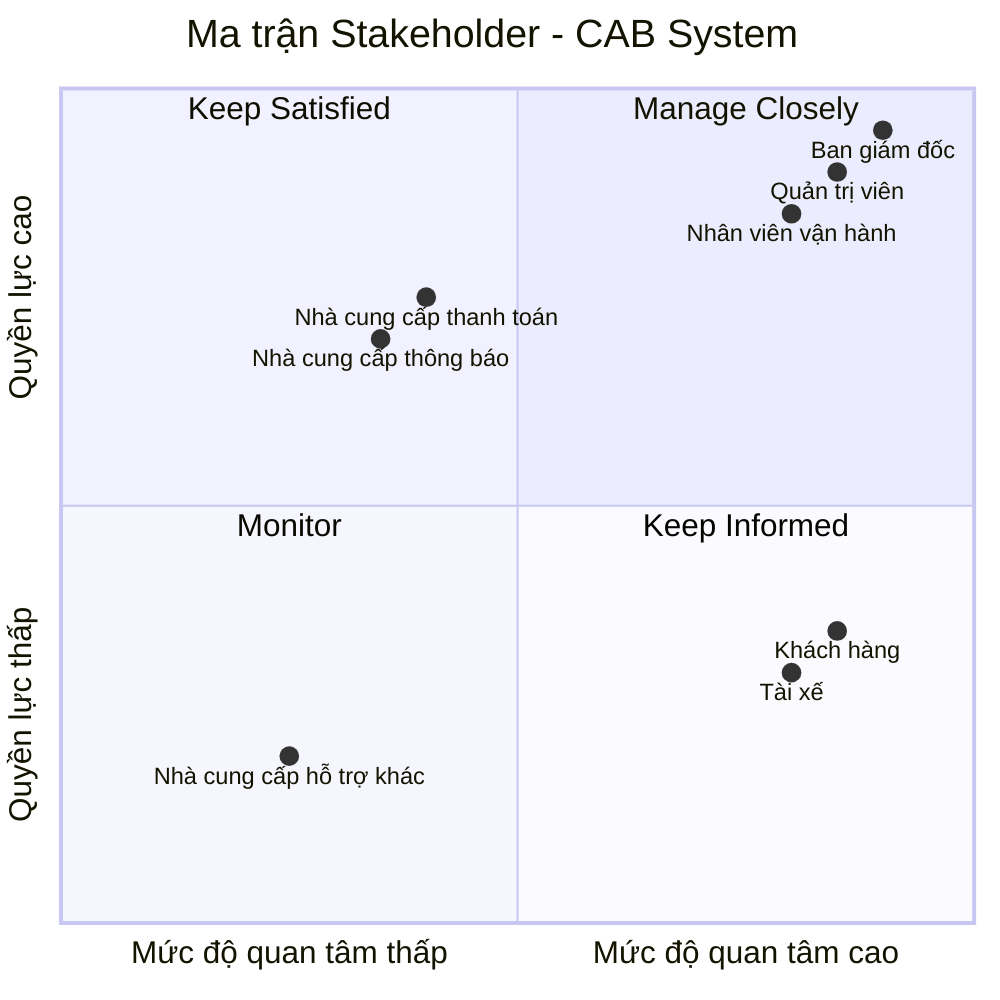
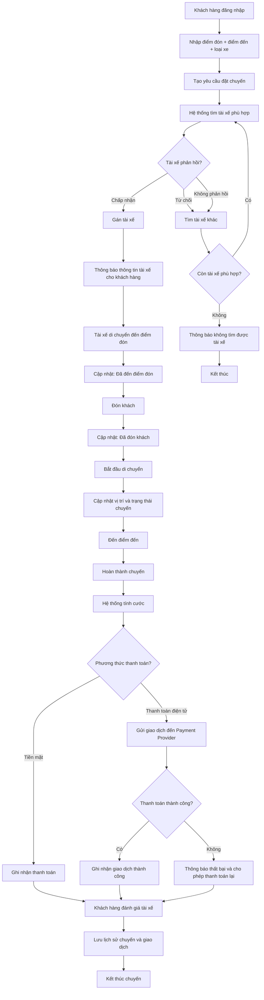

**1 Phân tích nghiệp vụ**

Dự án xây dựng nền tảng đặt xe CAB System của công ty ABC hướng tới mục tiêu cốt lõi là tự động hóa quy trình phân công tài xế, quản lý thanh toán tập trung và dễ dàng mở rộng quy mô hoạt động với thời gian triển khai dự kiến trong 7 tuần. Về mặt nghiệp vụ, hệ thống cần vận hành trơn tru toàn bộ vòng đời của một chuyến đi: từ lúc khách hàng tạo yêu cầu, hệ thống tự động quét và điều phối tài xế phù hợp dựa trên vị trí, cho đến khi chuyến đi hoàn thành và ghi nhận thanh toán. Để đáp ứng quy trình này, nền tảng đòi hỏi các nhóm chức năng toàn diện cho ba đối tượng chính: khách hàng (đặt xe, theo dõi hành trình thực tế, đánh giá và thanh toán đa phương thức), tài xế (tiếp nhận cuốc xe, cập nhật trạng thái di chuyển, định vị GPS liên tục) và nhân viên vận hành (giám sát chuyến đi, phân quyền quản trị, xem báo cáo hiệu suất). Bên cạnh đó, kiến trúc hệ thống phải đáp ứng các yêu cầu phi chức năng khắt khe về hiệu suất chịu tải cao, khả năng mở rộng độc lập từng module (như thanh toán, thông báo) mà không gây gián đoạn, cùng với cơ chế bảo mật dữ liệu và lưu vết giao dịch chặt chẽ. Tuy nhiên, trước khi tiến hành thiết kế chi tiết, Business Analyst cần làm rõ với ban lãnh đạo các quy tắc nghiệp vụ vẫn đang bỏ ngỏ, bao gồm thuật toán tính cước, tiêu chí ưu tiên phân công, thời gian giới hạn phản hồi của tài xế, chính sách hủy chuyến và các kịch bản xử lý ngoại lệ khi mất kết nối mạng.

**2 stakholder**
| **Stakeholder** | **Vai trò** | **Mối quan tâm / Nhu cầu** |
|---|---|---|
| **Khách hàng (Customer)** | Người sử dụng dịch vụ đặt xe | Đăng ký, đặt xe, theo dõi chuyến, thanh toán, xem lịch sử và đánh giá tài xế |
| **Tài xế (Driver)** | Người nhận và thực hiện chuyến | Quản lý hồ sơ/phương tiện, nhận hoặc từ chối chuyến, cập nhật trạng thái và vị trí |
| **Nhân viên vận hành (Operator)** | Quản lý và giám sát hoạt động hệ thống | Quản lý khách hàng, tài xế, phương tiện, chuyến đi; xử lý sự cố và theo dõi hoạt động |
| **Quản trị viên (Administrator)** | Quản trị hệ thống và phân quyền | Quản lý tài khoản, phân quyền, cấu hình và kiểm soát các thao tác nhạy cảm |
| **Ban giám đốc (Management)** | Bên định hướng và ra quyết định | Theo dõi báo cáo doanh thu, số chuyến, tỷ lệ hoàn thành/hủy và hiệu quả hoạt động |
| **Nhà cung cấp thanh toán (Payment Provider)** | Xử lý giao dịch thanh toán điện tử | Tiếp nhận và xử lý thanh toán, trả kết quả giao dịch cho hệ thống |
| **Nhà cung cấp thông báo (Notification Provider)** | Cung cấp dịch vụ gửi thông báo | Gửi thông báo đến khách hàng và tài xế qua các kênh như SMS, email, push notification |

**3 Ma trận stakeholder CAB**

4 Xác định phạm vi cần làm cho dự án này là 7 tuần 
| **Phạm vi** | **Chức năng chính** | **Giải thích** |
|---|---|---|
| **1. Quản lý xác thực người dùng** | Đăng ký, đăng nhập, đăng xuất, phân quyền cơ bản | Đây là nền tảng để khách hàng, tài xế và nhân viên sử dụng hệ thống an toàn. |
| **2. Quản lý khách hàng** | Quản lý hồ sơ, thông tin cá nhân, lịch sử chuyến | Cần thiết để khách hàng có tài khoản và sử dụng dịch vụ đặt xe. |
| **3. Quản lý tài xế** | Hồ sơ tài xế, thông tin xe, trạng thái sẵn sàng/không sẵn sàng | Là dữ liệu cần thiết để hệ thống tìm và phân công tài xế. |
| **4. Đặt xe** | Nhập điểm đón, điểm đến, chọn loại xe, tạo yêu cầu | Đây là **chức năng nghiệp vụ cốt lõi** của hệ thống CAB. |
| **5. Tìm và phân công tài xế** | Tìm tài xế phù hợp, ưu tiên tài xế gần, nhận/từ chối chuyến | Đây là vấn đề lớn nhất của hệ thống cũ và là chức năng cốt lõi cần tự động hóa. |
| **6. Quản lý chuyến đi** | Theo dõi trạng thái: chờ tài xế → đã nhận → đến điểm đón → đang đi → hoàn thành | Giúp quản lý toàn bộ vòng đời của một chuyến xe. |
| **7. Tính cước cơ bản** | Tính số tiền dựa trên loại xe và thông tin chuyến | Cần thiết để xác định số tiền khách hàng phải thanh toán. |
| **8. Thanh toán cơ bản** | Tiền mặt và tích hợp thanh toán điện tử ở mức cơ bản | Hoàn thiện quy trình từ đặt xe đến thanh toán. Không lưu thông tin thẻ nhạy cảm trong CAB. |
| **9. Thông báo cơ bản** | Thông báo khi đặt xe, có tài xế nhận, hoàn thành chuyến, thanh toán | Giúp khách hàng và tài xế biết trạng thái quan trọng của chuyến. |
| **10. Lịch sử chuyến đi** | Xem các chuyến đã thực hiện và số tiền | Đây là chức năng cơ bản phục vụ khách hàng và tra cứu. |
| **11. Đánh giá tài xế** | Khách hàng đánh giá sau khi hoàn thành chuyến | Đáp ứng yêu cầu cơ bản sau chuyến đi. |
| **12. Quản trị vận hành cơ bản** | Xem khách hàng, tài xế, chuyến đi; xử lý các trường hợp cơ bản | Cho phép nhân viên vận hành giám sát và hỗ trợ hệ thống. |

5 Chuyển thành yêu cầu doanh nghiệp
| **STT** | **Nghiệp vụ** | **Yêu cầu nghiệp vụ (Business Requirement)** | 
|---|---|---|
| 1 | **Xác thực người dùng** | Hệ thống phải cho phép khách hàng, tài xế đăng ký, đăng nhập, đăng xuất và xác thực trước khi sử dụng các chức năng yêu cầu tài khoản. |
| 2 | **Quản lý khách hàng** | Hệ thống phải cho phép khách hàng cập nhật và quản lý thông tin cá nhân, đồng thời lưu lịch sử các chuyến đã thực hiện. | 
| 3 | **Quản lý tài xế** | Hệ thống phải cho phép quản lý hồ sơ tài xế, thông tin phương tiện và trạng thái sẵn sàng nhận chuyến. | 
| 4 | **Tạo yêu cầu đặt xe** | Hệ thống phải cho phép khách hàng nhập **điểm đón, điểm đến, loại xe** và gửi yêu cầu đặt xe. | 
| 5 | **Tìm tài xế** | Sau khi khách hàng đặt xe, hệ thống phải tự động tìm các tài xế phù hợp dựa trên vị trí, trạng thái sẵn sàng và loại xe. | 
| 6 | **Phân công tài xế** | Hệ thống phải gửi yêu cầu đến tài xế phù hợp; nếu tài xế từ chối hoặc không phản hồi thì hệ thống tiếp tục tìm tài xế khác. | 
| 7 | **Xác nhận chuyến** | Khi tài xế chấp nhận, hệ thống phải xác nhận chuyến và thông báo cho khách hàng thông tin tài xế. | 
| 8 | **Theo dõi chuyến đi** | Trong quá trình thực hiện chuyến, hệ thống phải cho phép khách hàng theo dõi trạng thái như **đang tìm tài xế → tài xế đã nhận → đã đến điểm đón → đã đón khách → đang di chuyển → hoàn thành**. | 
| 9 | **Cập nhật trạng thái chuyến** | Tài xế phải có thể cập nhật trạng thái chuyến theo từng giai đoạn thực tế. | 
| 10 | **Tính cước** | Sau khi chuyến hoàn thành, hệ thống phải xác định số tiền khách hàng phải trả dựa trên loại dịch vụ và thông tin chuyến đi. | 
| 11 | **Thanh toán** | Hệ thống phải hỗ trợ **thanh toán tiền mặt hoặc thanh toán điện tử** thông qua nhà cung cấp bên ngoài. | 
| 12 | **Xử lý thanh toán thất bại** | Nếu thanh toán điện tử thất bại, hệ thống phải thông báo cho khách hàng và cho phép thực hiện thanh toán lại theo chính sách doanh nghiệp. | 
| 13 | **Thông báo** | Hệ thống phải gửi thông báo khi đặt xe thành công, tài xế nhận chuyến, tài xế đến điểm đón, chuyến hoàn thành và thanh toán có kết quả. | 
| 14 | **Hoàn thành chuyến** | Khi tài xế xác nhận hoàn thành, hệ thống phải cập nhật chuyến sang trạng thái hoàn thành và lưu thông tin chuyến. | 
| 15 | **Đánh giá tài xế** | Sau khi hoàn thành chuyến, hệ thống phải cho phép khách hàng đánh giá tài xế/chất lượng chuyến đi. | 
| 16 | **Lịch sử chuyến đi** | Khách hàng phải có thể xem lại các chuyến đã thực hiện, trạng thái và số tiền đã thanh toán. | 
| 17 | **Quản lý vận hành** | Nhân viên vận hành phải có thể xem và quản lý khách hàng, tài xế, phương tiện và các chuyến đang diễn ra. | 
| 18 | **Xử lý chuyến lỗi** | Nhân viên vận hành phải có thể kiểm tra và hỗ trợ xử lý các trường hợp chuyến đi bị lỗi. | 
| 19 | **Phân quyền quản trị** | Hệ thống phải kiểm soát quyền truy cập để nhân viên chỉ thực hiện được các chức năng được cấp quyền. | 
| 20 | **Báo cáo cơ bản** | Hệ thống phải cung cấp báo cáo cơ bản về số lượng chuyến, doanh thu, tỷ lệ hoàn thành và tỷ lệ hủy. | 

6 Functional Requirements 
6.1. Quản lý tài khoản
| **ID** | **Chức năng** | **Mô tả** |
|---|---|---|
| FR-01 | Đăng ký tài khoản | Khách hàng có thể đăng ký tài khoản; tài xế có thể đăng ký hoặc được nhân viên vận hành tạo tài khoản. |
| FR-02 | Đăng nhập | Người dùng có tài khoản có thể đăng nhập vào hệ thống. |
| FR-03 | Đăng xuất | Người dùng có thể đăng xuất khỏi hệ thống. |
| FR-04 | Cập nhật thông tin | Khách hàng và tài xế có thể xem và cập nhật thông tin cá nhân. |
| FR-05 | Phân quyền | Hệ thống phân quyền người dùng theo vai trò và kiểm soát các chức năng quản trị. |
6.2. Quản lý tài xế và phương tiện
| ID | Chức năng | Mô tả |
|---|---|---|
| FR-06 | Quản lý hồ sơ tài xế | Tài xế có thể xem và cập nhật thông tin hồ sơ cá nhân. |
| FR-07 | Quản lý phương tiện | Tài xế có thể cập nhật thông tin phương tiện; nhân viên vận hành có thể quản lý thông tin phương tiện. |
| FR-08 | Trạng thái hoạt động | Tài xế có thể chuyển sang trạng thái sẵn sàng hoặc không sẵn sàng nhận chuyến. |
| FR-09 | Cập nhật vị trí | Hệ thống ghi nhận vị trí của tài xế để hỗ trợ tìm tài xế và dự kiến thời gian đến. |
6.3. Đặt xe
| ID | Chức năng | Mô tả |
|---|---|---|
| FR-10 | Nhập điểm đón | Khách hàng nhập địa điểm đón. |
| FR-11 | Nhập điểm đến | Khách hàng nhập địa điểm cần đến. |
| FR-12 | Chọn loại xe | Khách hàng lựa chọn loại xe phù hợp. |
| FR-13 | Tạo yêu cầu đặt xe | Khách hàng gửi yêu cầu đặt xe đến hệ thống. |
| FR-14 | Theo dõi yêu cầu | Khách hàng có thể theo dõi trạng thái yêu cầu đặt xe. |
6.4. Tìm và phân công tài xế
| ID | Chức năng | Mô tả |
|---|---|---|
| FR-15 | Tìm tài xế | Hệ thống tìm các tài xế phù hợp dựa trên vị trí, trạng thái sẵn sàng và loại xe. |
| FR-16 | Ưu tiên tài xế | Hệ thống ưu tiên tài xế phù hợp và gần khách hàng theo các tiêu chí vận hành. |
| FR-17 | Gửi yêu cầu chuyến | Hệ thống gửi thông tin yêu cầu chuyến đến tài xế phù hợp. |
| FR-18 | Chấp nhận chuyến | Tài xế có thể chấp nhận yêu cầu chuyến. |
| FR-19 | Từ chối chuyến | Tài xế có thể từ chối yêu cầu chuyến. |
| FR-20 | Tìm tài xế thay thế | Nếu tài xế từ chối hoặc không phản hồi, hệ thống tiếp tục tìm tài xế khác. |
| FR-21 | Thông báo không tìm được tài xế | Hệ thống thông báo cho khách hàng khi không tìm được tài xế phù hợp. |
6.5. Quản lý chuyến đi
| ID | Chức năng | Mô tả |
|---|---|---|
| FR-22 | Xác nhận chuyến | Hệ thống xác nhận chuyến khi tài xế chấp nhận yêu cầu. |
| FR-23 | Cập nhật trạng thái | Tài xế có thể cập nhật trạng thái của chuyến đi. |
| FR-24 | Đã đến điểm đón | Tài xế cập nhật trạng thái khi đã đến điểm đón. |
| FR-25 | Đã đón khách | Tài xế cập nhật trạng thái khi đã đón khách. |
| FR-26 | Đang di chuyển | Tài xế cập nhật trạng thái khi bắt đầu di chuyển. |
| FR-27 | Hoàn thành chuyến | Tài xế cập nhật trạng thái khi chuyến đi hoàn thành. |
| FR-28 | Theo dõi chuyến | Khách hàng có thể theo dõi trạng thái hiện tại của chuyến đi. |
6.6. Tính cước và thanh toán
| ID | Chức năng | Mô tả |
|---|---|---|
| FR-29 | Tính cước | Hệ thống xác định số tiền khách hàng phải trả dựa trên loại dịch vụ và thông tin chuyến đi. |
| FR-30 | Thanh toán tiền mặt | Khách hàng có thể thanh toán bằng tiền mặt. |
| FR-31 | Thanh toán điện tử | Khách hàng có thể thanh toán điện tử thông qua nhà cung cấp thanh toán bên ngoài. |
| FR-32 | Xử lý thanh toán thất bại | Hệ thống thông báo cho khách hàng khi thanh toán điện tử thất bại và cho phép xử lý lại theo chính sách của doanh nghiệp. |
| FR-33 | Tra cứu giao dịch | Nhân viên vận hành có quyền có thể tra cứu lịch sử và trạng thái giao dịch. |
6.7. Thông báo
| ID | Chức năng | Mô tả |
|---|---|---|
| FR-34 | Thông báo tiếp nhận yêu cầu | Hệ thống thông báo khi yêu cầu đặt xe được tiếp nhận. |
| FR-35 | Thông báo tài xế nhận chuyến | Hệ thống thông báo khi có tài xế nhận chuyến. |
| FR-36 | Thông báo tài xế đến điểm đón | Hệ thống thông báo khi tài xế đến điểm đón. |
| FR-37 | Thông báo hoàn thành chuyến | Hệ thống thông báo khi chuyến đi hoàn thành. |
| FR-38 | Thông báo kết quả thanh toán | Hệ thống thông báo cho khách hàng về kết quả thanh toán. |
| FR-39 | Thông báo chuyến mới | Tài xế nhận thông báo khi có yêu cầu chuyến mới hoặc thay đổi liên quan đến chuyến đang thực hiện. |
6.8. Lịch sử và đánh giá
| ID | Chức năng | Mô tả |
|---|---|---|
| FR-40 | Xem lịch sử chuyến | Khách hàng có thể xem lịch sử các chuyến đi đã thực hiện. |
| FR-41 | Xem chi tiết chuyến | Khách hàng có thể xem thông tin chi tiết và số tiền phải trả của chuyến đi. |
| FR-42 | Đánh giá tài xế | Khách hàng có thể đánh giá tài xế sau khi chuyến đi hoàn thành. |
6.9. Quản trị và vận hành
| ID | Chức năng | Mô tả |
|---|---|---|
| FR-43 | Quản lý khách hàng | Nhân viên vận hành có thể xem và quản lý thông tin khách hàng. |
| FR-44 | Quản lý tài xế | Nhân viên vận hành có thể xem và quản lý thông tin tài xế. |
| FR-45 | Quản lý phương tiện | Nhân viên vận hành có thể quản lý thông tin phương tiện. |
| FR-46 | Theo dõi chuyến đang diễn ra | Nhân viên vận hành có thể xem các chuyến đang thực hiện và trạng thái tài xế. |
| FR-47 | Xử lý chuyến lỗi | Nhân viên vận hành có thể hỗ trợ xử lý các trường hợp chuyến đi gặp sự cố. |
| FR-48 | Quản lý tài khoản | Nhân viên vận hành có quyền quản trị có thể quản lý tài khoản người dùng. |
| FR-49 | Phân quyền người dùng | Nhân viên vận hành có quyền quản trị có thể phân quyền cho các vai trò phù hợp. |
6.10. Báo cáo
| ID | Chức năng | Mô tả |
|---|---|---|
| FR-50 | Báo cáo số lượng chuyến | Hệ thống cung cấp báo cáo về số lượng chuyến. |
| FR-51 | Báo cáo doanh thu | Hệ thống cung cấp báo cáo về doanh thu. |
| FR-52 | Tỷ lệ hoàn thành | Hệ thống cung cấp tỷ lệ chuyến đi hoàn thành. |
| FR-53 | Tỷ lệ hủy | Hệ thống cung cấp tỷ lệ chuyến đi bị hủy. |
| FR-54 | Hiệu quả tài xế | Hệ thống cung cấp thông tin về hiệu quả hoạt động của tài xế. |
6.11. Xác thực và Audit
| ID | Chức năng | Mô tả |
|---|---|---|
| FR-55 | Xác thực người dùng | Hệ thống yêu cầu khách hàng và tài xế xác thực trước khi sử dụng các chức năng yêu cầu tài khoản. |
| FR-56 | Kiểm soát quyền truy cập | Hệ thống kiểm tra quyền trước khi người dùng thực hiện các chức năng quản trị. |
| FR-57 | Ghi nhận thao tác | Hệ thống lưu vết các thao tác quan trọng để phục vụ kiểm tra và xử lý sự cố. |

7 Vẽ usecase

```mermaid
flowchart LR

    %% ===== ACTORS =====
    Customer([Customer<br/>Khách hàng])
    Driver([Driver<br/>Tài xế])
    Operator([Operator<br/>Nhân viên vận hành])
    Admin([Administrator<br/>Quản trị viên])
    Payment([Payment Provider<br/>Nhà cung cấp thanh toán])
    Notification([Notification Provider<br/>Nhà cung cấp thông báo])

    %% ===== CAB SYSTEM =====
    subgraph CAB["CAB System"]

        %% Customer Use Cases
        UC01((Đăng ký))
        UC02((Đăng nhập))
        UC03((Đăng xuất))
        UC04((Đặt chuyến))
        UC05((Theo dõi chuyến đi))
        UC06((Hủy chuyến))
        UC07((Thanh toán))
        UC08((Đánh giá tài xế))
        UC09((Quản lý lịch sử))
        UC10((Cập nhật thông tin cá nhân))

        %% Driver Use Cases
        UC11((Cập nhật hồ sơ))
        UC12((Quản lý phương tiện))
        UC13((Cập nhật trạng thái hoạt động))
        UC14((Cập nhật vị trí))
        UC15((Nhận yêu cầu chuyến))
        UC16((Chấp nhận chuyến))
        UC17((Từ chối chuyến))
        UC18((Cập nhật trạng thái chuyến))
        UC19((Hoàn thành chuyến))

        %% Operator Use Cases
        UC20((Quản lý khách hàng))
        UC21((Quản lý tài xế))
        UC22((Quản lý phương tiện))
        UC23((Theo dõi chuyến))
        UC24((Xử lý chuyến lỗi))
        UC25((Tra cứu giao dịch))
        UC26((Xem báo cáo))

        %% Administrator Use Cases
        UC27((Quản lý tài khoản))
        UC28((Phân quyền người dùng))
        UC29((Xem nhật ký thao tác))

        %% System Use Cases
        UC30((Tìm tài xế))
        UC31((Phân công tài xế))
        UC32((Tính cước))
        UC33((Gửi thông báo))
    end

    %% ===== CUSTOMER =====
    Customer --- UC01
    Customer --- UC02
    Customer --- UC03
    Customer --- UC04
    Customer --- UC05
    Customer --- UC06
    Customer --- UC07
    Customer --- UC08
    Customer --- UC09
    Customer --- UC10

    %% Customer internal relationships
    UC04 -.->|include| UC30
    UC30 -.->|include| UC31
    UC04 -.->|include| UC32

    %% ===== DRIVER =====
    Driver --- UC02
    Driver --- UC03
    Driver --- UC11
    Driver --- UC12
    Driver --- UC13
    Driver --- UC14
    Driver --- UC15
    Driver --- UC16
    Driver --- UC17
    Driver --- UC18
    Driver --- UC19

    %% ===== OPERATOR =====
    Operator --- UC02
    Operator --- UC20
    Operator --- UC21
    Operator --- UC22
    Operator --- UC23
    Operator --- UC24
    Operator --- UC25
    Operator --- UC26

    %% ===== ADMIN =====
    Admin --- UC02
    Admin --- UC27
    Admin --- UC28
    Admin --- UC29

    %% ===== EXTERNAL SYSTEMS =====
    Payment --- UC07
    Notification --- UC33

    %% ===== NOTIFICATION RELATIONSHIPS =====
    UC04 -.->|trigger| UC33
    UC16 -.->|trigger| UC33
    UC18 -.->|trigger| UC33
    UC19 -.->|trigger| UC33
    UC07 -.->|trigger| UC33
```

8 đặc tả use case

UC-01: Đăng ký tài khoản

| **Thuộc tính** | **Mô tả** |
|---|---|
| **Use Case ID** | UC-01 |
| **Tên Use Case** | Đăng ký tài khoản |
| **Actor** | Customer / Driver |
| **Mục đích** | Tạo tài khoản để sử dụng hệ thống CAB |
| **Tiền điều kiện** | Người dùng chưa có tài khoản |
| **Hậu điều kiện** | Tài khoản được tạo thành công |
| **Luồng chính** | 1. Người dùng chọn Đăng ký. 2. Nhập thông tin cần thiết. 3. Hệ thống kiểm tra dữ liệu. 4. Hệ thống tạo tài khoản. 5. Thông báo đăng ký thành công. |
| **Ngoại lệ** | Email/số điện thoại đã tồn tại hoặc thông tin không hợp lệ → hệ thống thông báo lỗi và yêu cầu nhập lại. |

UC-02: Đăng nhập

| **Thuộc tính** | **Mô tả** |
|---|---|
| **Use Case ID** | UC-02 |
| **Tên Use Case** | Đăng nhập |
| **Actor** | Customer / Driver / Operator / Administrator |
| **Mục đích** | Xác thực người dùng để truy cập hệ thống |
| **Tiền điều kiện** | Người dùng đã có tài khoản |
| **Hậu điều kiện** | Người dùng đăng nhập thành công và được cấp quyền tương ứng |
| **Luồng chính** | 1. Nhập tài khoản và mật khẩu. 2. Hệ thống kiểm tra thông tin. 3. Xác thực thành công. 4. Hệ thống cho phép truy cập theo vai trò. |
| **Ngoại lệ** | Sai tài khoản/mật khẩu → thông báo đăng nhập thất bại. |

UC-03: Đặt chuyến

| **Thuộc tính** | **Mô tả** |
|---|---|
| **Use Case ID** | UC-03 |
| **Tên Use Case** | Đặt chuyến |
| **Actor** | Customer |
| **Mục đích** | Tạo yêu cầu đặt xe |
| **Tiền điều kiện** | Customer đã đăng nhập |
| **Hậu điều kiện** | Yêu cầu đặt xe được tạo và chuyển sang trạng thái tìm tài xế |
| **Luồng chính** | 1. Customer chọn Đặt chuyến. 2. Nhập điểm đón. 3. Nhập điểm đến. 4. Chọn loại xe. 5. Xác nhận yêu cầu. 6. Hệ thống tạo chuyến. 7. Hệ thống bắt đầu tìm tài xế. |
| **Ngoại lệ** | Thiếu thông tin hoặc địa điểm không hợp lệ → yêu cầu nhập lại. |

UC-04: Tìm và phân công tài xế

| **Thuộc tính** | **Mô tả** |
|---|---|
| **Use Case ID** | UC-04 |
| **Tên Use Case** | Tìm và phân công tài xế |
| **Actor** | CAB System / Driver |
| **Mục đích** | Tìm và phân công tài xế phù hợp cho chuyến |
| **Tiền điều kiện** | Có yêu cầu đặt xe hợp lệ |
| **Hậu điều kiện** | Một tài xế được phân công hoặc hệ thống thông báo không tìm được tài xế |
| **Luồng chính** | 1. Hệ thống xác định các tài xế phù hợp. 2. Ưu tiên tài xế gần khách hàng. 3. Gửi yêu cầu chuyến. 4. Tài xế nhận chuyến. 5. Hệ thống xác nhận tài xế cho Customer. |
| **Luồng thay thế** | Tài xế từ chối/không phản hồi → hệ thống tìm và gửi yêu cầu cho tài xế khác. |
| **Ngoại lệ** | Không có tài xế phù hợp → thông báo cho Customer. |

UC-05: Theo dõi chuyến đi

| **Thuộc tính** | **Mô tả** |
|---|---|
| **Use Case ID** | UC-05 |
| **Tên Use Case** | Theo dõi chuyến đi |
| **Actor** | Customer |
| **Mục đích** | Cho phép khách hàng theo dõi trạng thái chuyến |
| **Tiền điều kiện** | Customer đã có chuyến đang thực hiện |
| **Hậu điều kiện** | Customer xem được trạng thái hiện tại của chuyến |
| **Luồng chính** | 1. Customer mở chuyến đang thực hiện. 2. Hệ thống hiển thị tài xế. 3. Hiển thị trạng thái chuyến. 4. Cập nhật vị trí tài xế. 5. Customer tiếp tục theo dõi đến khi chuyến hoàn thành. |

UC-06: Cập nhật trạng thái chuyến

| **Thuộc tính** | **Mô tả** |
|---|---|
| **Use Case ID** | UC-06 |
| **Tên Use Case** | Cập nhật trạng thái chuyến |
| **Actor** | Driver |
| **Mục đích** | Cập nhật tình trạng thực tế của chuyến |
| **Tiền điều kiện** | Driver đã nhận chuyến |
| **Hậu điều kiện** | Trạng thái chuyến được cập nhật |
| **Luồng chính** | 1. Driver nhận chuyến. 2. Cập nhật Đã đến điểm đón. 3. Cập nhật Đã đón khách. 4. Cập nhật Đang di chuyển. 5. Cập nhật Hoàn thành. |
| **Ngoại lệ** | Không thể cập nhật do mất kết nối → hệ thống cho phép cập nhật lại khi kết nối được khôi phục. |

UC-07: Hủy chuyến

| **Thuộc tính** | **Mô tả** |
|---|---|
| **Use Case ID** | UC-07 |
| **Tên Use Case** | Hủy chuyến |
| **Actor** | Customer |
| **Mục đích** | Cho phép khách hàng hủy yêu cầu/chuyến theo chính sách doanh nghiệp |
| **Tiền điều kiện** | Chuyến chưa hoàn thành và còn trong trạng thái được phép hủy |
| **Hậu điều kiện** | Chuyến được chuyển sang trạng thái Hủy |
| **Luồng chính** | 1. Customer chọn Hủy chuyến. 2. Hệ thống kiểm tra điều kiện hủy. 3. Customer xác nhận. 4. Hệ thống cập nhật trạng thái. 5. Thông báo cho Driver nếu đã được phân công. |
| **Ngoại lệ** | Không được phép hủy theo chính sách → hệ thống thông báo lý do. |

UC-08: Thanh toán

| **Thuộc tính** | **Mô tả** |
|---|---|
| **Use Case ID** | UC-08 |
| **Tên Use Case** | Thanh toán |
| **Actor** | Customer / Payment Provider |
| **Mục đích** | Thanh toán chi phí chuyến đi |
| **Tiền điều kiện** | Chuyến đã hoàn thành và đã có cước phí |
| **Hậu điều kiện** | Giao dịch được ghi nhận thành công hoặc thất bại |
| **Luồng chính** | 1. Hệ thống tính cước. 2. Customer chọn phương thức thanh toán. 3. Nếu tiền mặt → ghi nhận thanh toán. 4. Nếu điện tử → chuyển sang Payment Provider. 5. Nhận kết quả giao dịch. 6. Lưu trạng thái thanh toán. |
| **Ngoại lệ** | Thanh toán điện tử thất bại → thông báo Customer và cho phép thanh toán lại theo chính sách. |

UC-09: Đánh giá tài xế

| **Thuộc tính** | **Mô tả** |
|---|---|
| **Use Case ID** | UC-09 |
| **Tên Use Case** | Đánh giá tài xế |
| **Actor** | Customer |
| **Mục đích** | Đánh giá chất lượng chuyến đi và tài xế |
| **Tiền điều kiện** | Chuyến đã hoàn thành |
| **Hậu điều kiện** | Đánh giá được lưu vào hệ thống |
| **Luồng chính** | 1. Customer mở chuyến đã hoàn thành. 2. Chọn mức đánh giá. 3. Nhập nhận xét nếu cần. 4. Gửi đánh giá. 5. Hệ thống lưu đánh giá. |
| **Ngoại lệ** | Đã đánh giá trước đó → hệ thống không cho đánh giá lại. |

UC-10: Quản lý lịch sử chuyến

| **Thuộc tính** | **Mô tả** |
|---|---|
| **Use Case ID** | UC-10 |
| **Tên Use Case** | Quản lý lịch sử chuyến |
| **Actor** | Customer |
| **Mục đích** | Tra cứu các chuyến đã thực hiện |
| **Tiền điều kiện** | Customer đã đăng nhập |
| **Hậu điều kiện** | Hiển thị danh sách và chi tiết lịch sử chuyến |
| **Luồng chính** | 1. Customer chọn Lịch sử chuyến. 2. Hệ thống hiển thị danh sách chuyến. 3. Customer chọn một chuyến. 4. Hệ thống hiển thị điểm đón, điểm đến, tài xế, trạng thái và số tiền. |

9 Quy trình nghiệp vụ

9.1. Quy trình đặt chuyến và tìm tài xế

| **Bước** | **Tác nhân** | **Hoạt động** | **Kết quả / Xử lý tiếp theo** |
|---|---|---|---|
| 1 | Khách hàng | Đăng nhập hệ thống | Đăng nhập thành công |
| 2 | Khách hàng | Nhập điểm đón, điểm đến, chọn loại xe | Hệ thống nhận thông tin chuyến |
| 3 | Khách hàng | Xác nhận đặt chuyến | Chuyến được tạo với trạng thái **Đang tìm tài xế** |
| 4 | Hệ thống | Tìm tài xế phù hợp dựa trên vị trí, trạng thái sẵn sàng và loại xe | Xác định tài xế phù hợp |
| 5 | Hệ thống | Gửi yêu cầu chuyến cho tài xế ưu tiên | Tài xế nhận thông báo |
| 6 | Tài xế | Xem thông tin chuyến | Quyết định **Chấp nhận / Từ chối** |
| 7A | Tài xế | **Chấp nhận chuyến** | Hệ thống gán tài xế cho chuyến |
| 8A | Hệ thống | Gửi thông báo cho khách hàng | Khách hàng biết tài xế và thời gian dự kiến đến |
| 9A | Tài xế | Di chuyển đến điểm đón | Trạng thái **Đang đến điểm đón** |
| 7B | Tài xế | **Từ chối chuyến** | Hệ thống bỏ tài xế hiện tại |
| 8B | Hệ thống | Tìm tài xế phù hợp tiếp theo | Gửi yêu cầu cho tài xế khác |
| 9B | Hệ thống | Không còn tài xế phù hợp | Thông báo **Không tìm được tài xế** cho khách hàng |

9.2. Quy trình sau khi tài xế chấp nhận

| **Bước** | **Tác nhân** | **Hoạt động** | **Kết quả** |
|---|---|---|---|
| 1 | Tài xế | Nhận và xác nhận chuyến | Chuyến được phân công |
| 2 | Tài xế | Di chuyển đến điểm đón | Trạng thái **Đang đến** |
| 3 | Tài xế | Đến điểm đón | Cập nhật **Đã đến điểm đón** |
| 4 | Hệ thống | Thông báo cho khách hàng | Khách hàng biết tài xế đã đến |
| 5 | Tài xế | Đón khách | Cập nhật **Đã đón khách** |
| 6 | Tài xế | Bắt đầu di chuyển | Cập nhật **Đang di chuyển** |
| 7 | Hệ thống | Ghi nhận vị trí tài xế | Khách hàng theo dõi chuyến |
| 8 | Tài xế | Đến điểm đến | Chuẩn bị hoàn thành |
| 9 | Tài xế | Xác nhận hoàn thành chuyến | Trạng thái **Hoàn thành** |

9.3. Quy trình thanh toán và đánh giá

| **Bước** | **Tác nhân** | **Hoạt động** | **Kết quả** |
|---|---|---|---|
| 1 | Hệ thống | Tính cước sau khi chuyến hoàn thành | Xác định số tiền phải trả |
| 2 | Khách hàng | Chọn phương thức thanh toán | Tiền mặt hoặc điện tử |
| 3A | Khách hàng | Thanh toán tiền mặt | Hệ thống ghi nhận đã thanh toán |
| 3B | Hệ thống | Gửi giao dịch đến nhà cung cấp thanh toán | Chờ kết quả |
| 4B | Payment Provider | Xử lý giao dịch | Thành công / thất bại |
| 5B | Hệ thống | Nhận kết quả thanh toán | Cập nhật trạng thái giao dịch |
| 6 | Hệ thống | Thông báo kết quả cho khách hàng | Khách hàng biết kết quả |
| 7 | Khách hàng | Đánh giá tài xế | Đánh giá được lưu |
| 8 | Hệ thống | Lưu thông tin chuyến, thanh toán và đánh giá | Hoàn tất vòng đời chuyến |

9.4. Các nhánh xử lý quan trọng

| **Tình huống** | **Cách xử lý** |
|---|---|
| Tài xế **chấp nhận** | Gán tài xế → thông báo khách hàng → tài xế đến đón → thực hiện chuyến |
| Tài xế **từ chối** | Không gán tài xế → tìm tài xế tiếp theo → tiếp tục cho đến khi có tài xế |
| Tài xế **không phản hồi** | Sau thời gian quy định, xem như không nhận → tìm tài xế khác |
| **Không có tài xế** | Hủy yêu cầu tìm tài xế và thông báo khách hàng |
| Khách hàng **hủy chuyến** | Kiểm tra điều kiện hủy → cập nhật trạng thái → thông báo cho tài xế nếu đã được phân công |
| Thanh toán **thành công** | Ghi nhận giao dịch → thông báo kết quả → cho phép đánh giá |
| Thanh toán **thất bại** | Thông báo lỗi → cho phép thanh toán lại theo chính sách doanh nghiệp |
| Chuyến **gặp lỗi** | Chuyển thông tin cho nhân viên vận hành kiểm tra và xử lý |

9.5. Business Process tổng quát – CAB System

10 Phân tích các quy tắc nghiệp vụ (Business Rules)

| **ID** | **Business Rule** | **Mô tả** |
|---|---|---|
| **BR-01** | Xác thực người dùng | Khách hàng, tài xế và nhân viên phải đăng nhập/xác thực trước khi sử dụng các chức năng yêu cầu tài khoản. |
| **BR-02** | Tài xế sẵn sàng | Chỉ tài xế có trạng thái **Sẵn sàng nhận chuyến** mới được hệ thống lựa chọn để phân công. |
| **BR-03** | Tài xế phù hợp | Tài xế được đề xuất phải phù hợp với **loại xe/dịch vụ** mà khách hàng đã lựa chọn. |
| **BR-04** | Ưu tiên tài xế gần | Khi tìm tài xế, hệ thống ưu tiên tài xế có **vị trí gần điểm đón** của khách hàng. |
| **BR-05** | Ưu tiên theo tiêu chí vận hành | Khi nhiều tài xế phù hợp, hệ thống có thể ưu tiên dựa trên **khoảng cách, trạng thái hoạt động, rating** theo chính sách doanh nghiệp. |
| **BR-06** | Một tài xế chỉ nhận một chuyến | Tài xế đang được phân công hoặc đang thực hiện chuyến không được đồng thời nhận chuyến khác. |
| **BR-07** | Thời gian phản hồi tài xế | Tài xế phải phản hồi yêu cầu trong thời gian quy định; quá thời gian được xem là **không phản hồi**. |
| **BR-08** | Tìm tài xế thay thế | Nếu tài xế từ chối hoặc không phản hồi, hệ thống phải tiếp tục tìm tài xế phù hợp khác. |
| **BR-09** | Không có tài xế | Nếu không tìm được tài xế phù hợp, hệ thống phải thông báo rõ cho khách hàng và kết thúc yêu cầu theo chính sách. |
| **BR-10** | Trạng thái chuyến | Chuyến đi phải được xử lý theo đúng thứ tự trạng thái: **Đang tìm tài xế → Đã nhận → Đã đến điểm đón → Đã đón khách → Đang di chuyển → Hoàn thành**. |
| **BR-11** | Cập nhật trạng thái | Chỉ tài xế được phân công mới có quyền cập nhật trạng thái chuyến của mình. |
| **BR-12** | Hủy chuyến | Khách hàng chỉ được hủy chuyến khi chuyến đang ở trạng thái cho phép hủy và phải tuân theo chính sách hủy của doanh nghiệp. |
| **BR-13** | Tính cước | Số tiền phải trả được xác định dựa trên **loại dịch vụ và thông tin chuyến đi** theo bảng giá của doanh nghiệp. |
| **BR-14** | Thanh toán tiền mặt | Nếu chọn tiền mặt, hệ thống ghi nhận thanh toán sau khi chuyến hoàn thành và tài xế xác nhận đã nhận tiền theo quy trình doanh nghiệp. |
| **BR-15** | Thanh toán điện tử | Thanh toán điện tử phải được xử lý thông qua **nhà cung cấp thanh toán bên ngoài**. |
| **BR-16** | Bảo mật thanh toán | CAB System không được lưu trực tiếp thông tin nhạy cảm của thẻ hoặc tài khoản thanh toán. |
| **BR-17** | Thanh toán thất bại | Nếu giao dịch điện tử thất bại, hệ thống phải thông báo cho khách hàng và cho phép xử lý lại theo chính sách. |
| **BR-18** | Đánh giá tài xế | Chỉ khách hàng đã hoàn thành chuyến mới được đánh giá tài xế của chuyến đó. |
| **BR-19** | Một chuyến một đánh giá | Mỗi khách hàng chỉ được đánh giá một lần cho một chuyến, trừ khi doanh nghiệp cho phép chỉnh sửa. |
| **BR-20** | Lưu lịch sử | Sau khi chuyến hoàn thành, thông tin chuyến và giao dịch phải được lưu vào lịch sử để tra cứu. |
| **BR-21** | Phân quyền | Người dùng chỉ được truy cập các chức năng phù hợp với vai trò được cấp. |
| **BR-22** | Quản trị viên | Chỉ người có quyền quản trị mới được thực hiện các thao tác nhạy cảm như quản lý tài khoản và phân quyền. |
| **BR-23** | Ghi log | Các thao tác quản trị và thao tác quan trọng phải được ghi nhận để phục vụ kiểm tra và xử lý sự cố. |
| **BR-24** | Thông báo | Các sự kiện quan trọng như tạo chuyến, tài xế nhận chuyến, tài xế đến điểm đón, hoàn thành chuyến và thanh toán phải được thông báo cho bên liên quan. |
| **BR-25** | Trạng thái tài xế | Khi tài xế nhận chuyến, trạng thái của tài xế phải được cập nhật để không tiếp tục được đề xuất cho chuyến khác. |
| **BR-26** | Vị trí tài xế | Hệ thống sử dụng vị trí hiện tại của tài xế để hỗ trợ tìm kiếm và theo dõi chuyến. |
| **BR-27** | Dữ liệu cá nhân | Thông tin cá nhân, phương tiện, vị trí và giao dịch phải được bảo vệ và chỉ cho phép truy cập theo quyền. |
| **BR-28** | Báo cáo | Các báo cáo về chuyến, doanh thu, tỷ lệ hoàn thành và hủy phải được tổng hợp từ dữ liệu giao dịch thực tế của hệ thống. |
